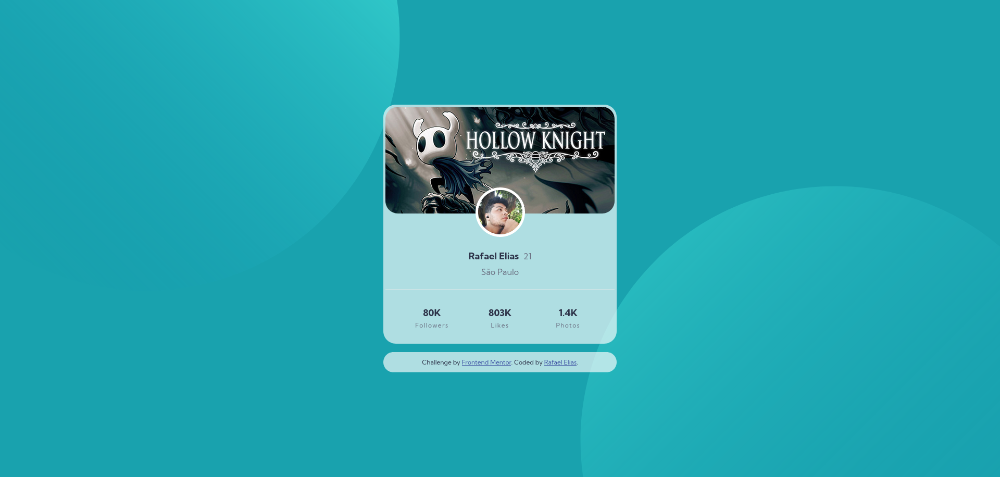

# Frontend Mentor - Profile card component solution

This is a solution to the [Profile card component challenge on Frontend Mentor](https://www.frontendmentor.io/challenges/profile-card-component-cfArpWshJ). Frontend Mentor challenges help you improve your coding skills by building realistic projects. 

## Table of contents

- [Overview](#overview)
  - [The challenge](#the-challenge)
  - [Screenshot](#screenshot)
  - [Links](#links)
- [My process](#my-process)
  - [Built with](#built-with)
  - [What I learned](#what-i-learned)
- [Author](#author)
- [Acknowledgments](#acknowledgments)

## Overview

### The challenge

- Build out the project to the designs provided

### Screenshot



### Links

- Solution URL: [github repository](https://github.com/RafisElias/profile-card-component)
- Live Site URL: [https://candid-sunburst-1f1c0c.netlify.app](https://candid-sunburst-1f1c0c.netlify.app)

## My process

### Built with

- Semantic HTML5 markup
- CSS custom properties
- Flexbox
- CSS Grid
- Mobile-first workflow

### What I learned

I learn how use the `backdrop-filter`:

```css
.blur {
  background: rgba(255, 255, 255, 0.65);
  backdrop-filter: blur(8px);
}
```

## Author
- Frontend Mentor - [@RafisElias](https://www.frontendmentor.io/profile/RafisElias)
- Twitter - [@rrprates](https://twitter.com/rrprates)